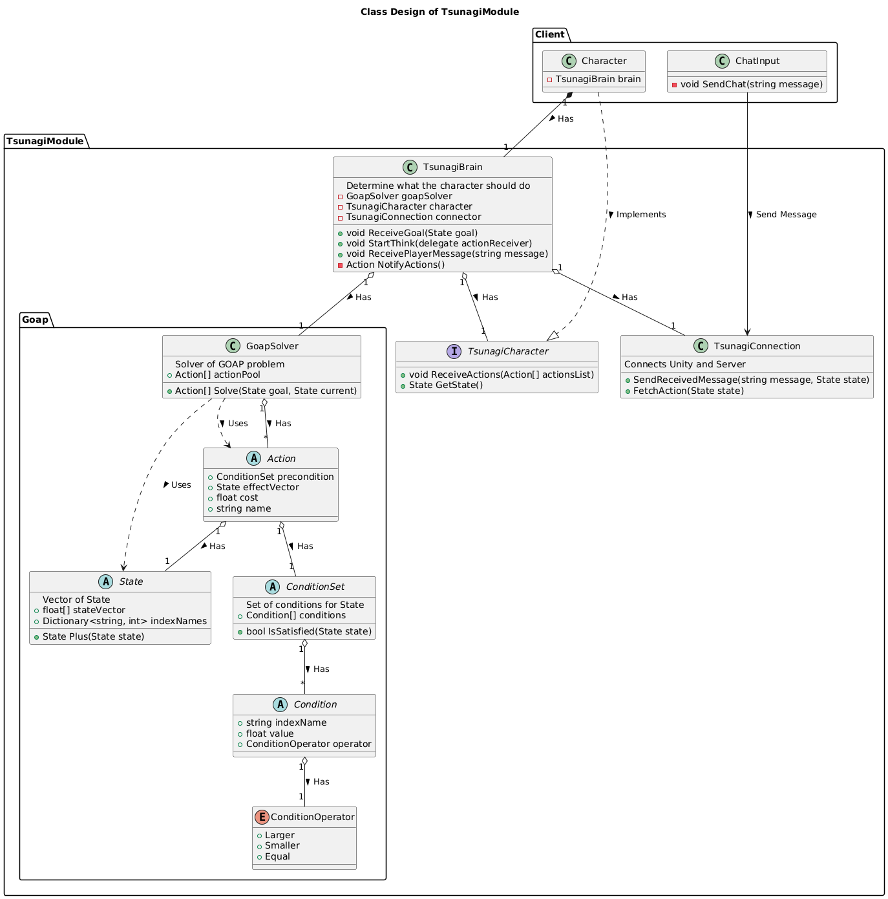
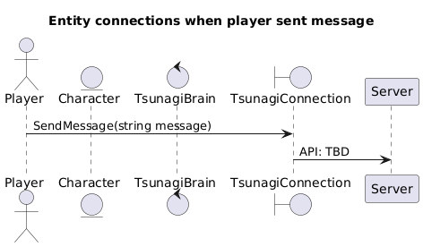
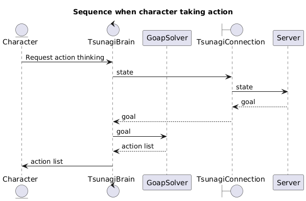

# TsunagiModuleDesign

## How to use PlantUML

### Generate UML diagrams

Copy and paste into: https://www.plantuml.com/plantuml/uml/SyfFKj2rKt3CoKnELR1Io4ZDoSa70000

### How to read UML

- Class Diagram: https://plantuml.com/class-diagram
- Sequence Diagram: https://plantuml.com/sequence-diagram

## How to review PR

https://docs.github.com/en/pull-requests/collaborating-with-pull-requests/reviewing-changes-in-pull-requests/reviewing-proposed-changes-in-a-pull-request

## Class Architecture

- This is design **NOT** to depend on GameEngine or specific language as much as possible.
- Design to be as abstract as possible. Doesn't depend on game genre.

### developer experience

#### Design GOAP components

create inheritance of...

- `Action` and its actual implementation
- `ConditionSet`
  - composed of `Condition`
- `State`

#### Run Tsunagi thinking

- Once developer-created `Character` ran `TsunagiBrain.StartThink()`, the TsunagiModule starts inferring, and gives a list of `Action` as output.
  - Developers can specify when to think

## Sequences

### When Chat Sent

### When taking Actions

